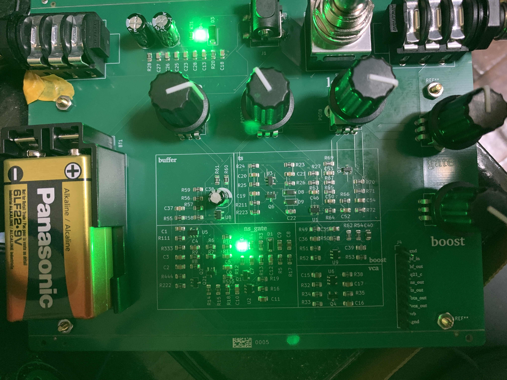
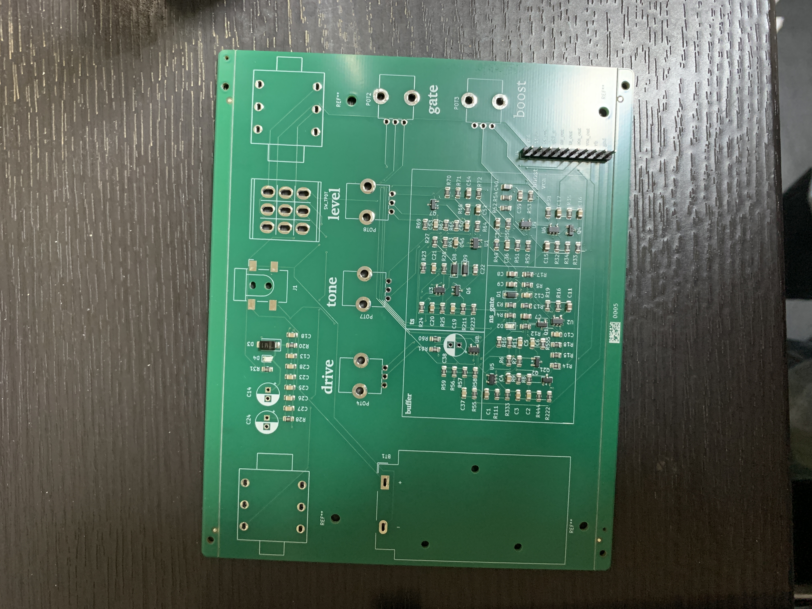
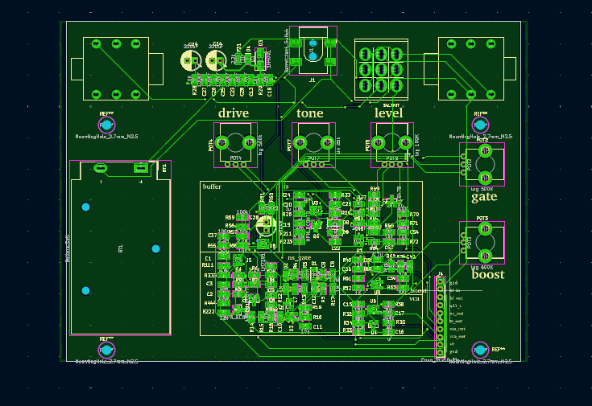
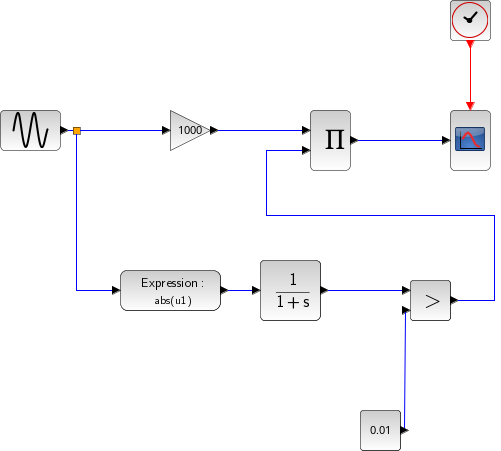
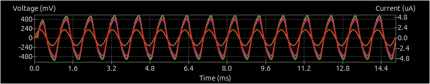
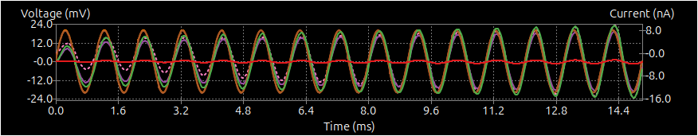

# level-gate-screamer
Tube Screamer-style overdrive with a level gate: attenuates below threshold, boosts above

> [!WARNING]
> **v1: J2/J3 footprints are rotated 180°.**
> Fix with jumpers on the bottom side:
> - J2: 1–6, 2–5
> - J3: 1–6, 4–2
>
> Next revision: rotate J2/J3 so the big protrusion faces the board edge.
>
> **Output level:** up to ~9 Vpp (rail-to-rail op-amps on 9 V).
> Check the input range of the next device before connecting.
> Tested OK with a Neural DSP Nano Cortex.

## Files
- `kicad_files/` — KiCad project
- `fabrication/` — Gerber, BOM, CPL for JLCPCB
- `hand_soldered_parts/` — parts not assembled by JLCPCB
- `simulation/` — ngspice netlist

## Images

### Finished PCB

### PCB just arrived

### PCB layout (KiCad)

### Schematic

Labeled as "OTA boost", but this isn't an OTA.
### Level gate concept

### Simulation: input above threshold (amplified)

### Simulation: input below threshold (attenuated)

## Impressions
- Sounds great
- Easy to play
- The gate works as intended

## References
- [UC3Music/IceScreamer](https://github.com/UC3Music/IceScreamer) — base Tube Screamer design and footprints
- [ElectroSmash Archive: Tube Screamer Analysis](https://electrosmash.mas-effects.com/tube-screamer-analysis)
- [ElectroSmash Archive: MXR MicroAmp Analysis](https://electrosmash.mas-effects.com/mxr-microamp) — boost stage
- [PCB Guitar Mania: No-Noise Gate building docs (PDF)](https://pcbguitarmania.com/wp-content/uploads/2018/07/No-Noise-Gate-1.2v-Building-Docs.pdf) — noise gate
- [Elliott Sound Products: VCA Techniques Investigated](https://sound-au.com/articles/vca-techniques.html) — JFET VCA (Figure B)
- Boss NS-2 — gate idea: detect on the dry signal, mute after the gain stage

